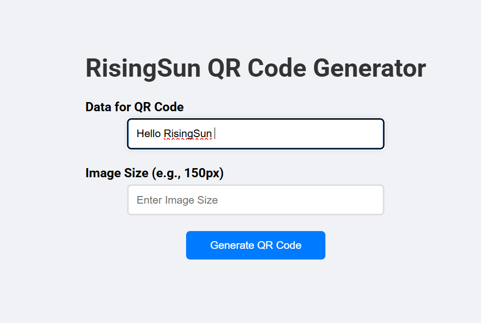

# 🚀 QR Code Generator

A simple and fast QR Code Generator built with **Vite + React**. Enter any text or URL, and instantly generate a downloadable QR code.

## 📸 Screenshots




## 🛠️ Features

- 🔁 Real-time QR Code generation
- ✍️ Supports custom text and URLs
- 📥 Download QR Code as an image
- ⚡️ Built with [Vite](https://vitejs.dev/) for super-fast development


## 🚀 Getting Started

### 1. Clone the Repo

```bash
git clone https://github.com/your-username/qr-code-generator.git
cd qr-code-generator
